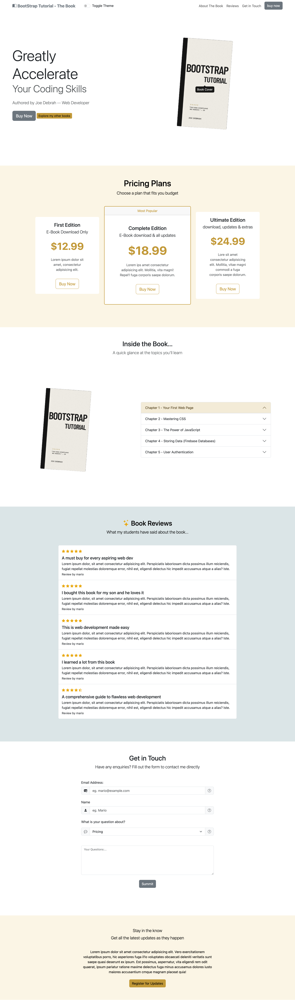
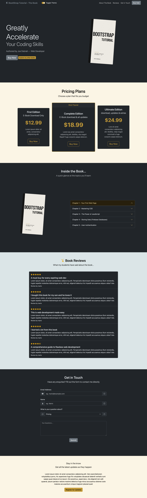

# Website built using BootStrap
---

### Author Links

👋 Hello there, I'm Joe Debrah

✅ [Check out my other Web Development portfolio here on Github](https://www.youtube.com/DaveGrayTeachesCode).

---
---

🚀 Check out my Linkedin below:

- [Github](https://github.com/JoeDebrah)
- [LinkedIn](https://www.linkedin.com/in/joe-debrah-953972264/)

---
## page demo
Light Mode

Dark Mode

---

### Description

🛠️ This is an interesting project i built with the help of the resources available of the bootstrap website and [Net Ninja](https://www.youtube.com/@NetNinja). It is a simple website to order a published E-book and was largely built with bootstrap. 

---
---

🌅 [Check the preview_screenshots for a preview of the site](https://youtu.be/JZjUv_qFtvM) for this repository.

---
---

### You can also run the html file using the live server extension on VsCode
---
---
### 📚 Website References
- 🔗 [Bootstrap Official Website](https://getbootstrap.com/)